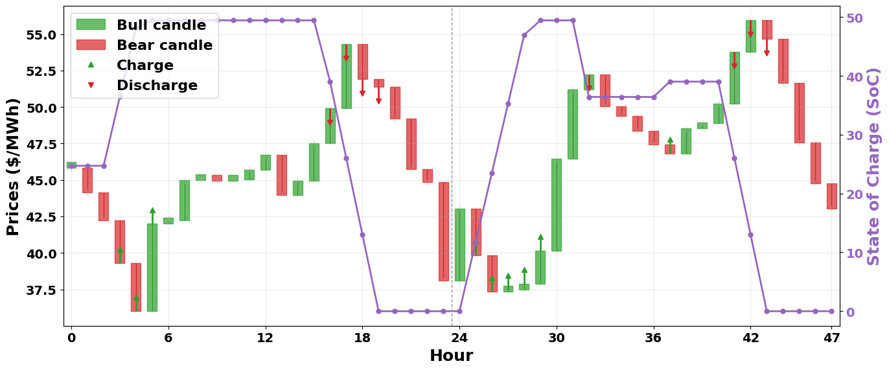

# Architecture

AlphaSearch has four main layers:

1. **Data & Forecasting**
2. **Optimization & Control**
3. **Reasoning & Explanation**
4. **Streamlit UI**

## 1. Core Libraries
- `agentic_energy` : Battery schemas, forecast models, optimization models, data loaders, MCP servers.
- `agentics` : Generic agent orchestration, CrewAI integration, tool abstractions

## 2. Agents & MCP Tools
- Forecasting MCP tools: price forecast generation
- Optimization tools: MILP solver, heuristic controllers, RL policy server
- Reasoning tools: explanation text + annotated plots
- LLM tools: Gemini / Ollama for chat and reasoning
Each tool is exposed through MCP and can be called by the agentic framework or directly in notebooks. Check details in [Agents and Tools](agents_and_tools.md) page.

## 3. High-Level Flow 
- User types a prompt in the Streamlit chat box.

- A zero-shot intent classifier maps it to: `Pipeline call`, `Reasoning call`, `Generic Q&A`

- For a `pipeline call`:
    1. The forecast agent chooses a model and generates price trajectories
    2. The optimizer agent picks an algorithm and computes a schedule
    3. The visualization MCP produces plots and animations

- For a `reasoning call`: A reasoning agent inspects the last run and explains why decisions were made

- For `generic Q&A`: The LLM answers using chat history + recent pipeline results as context.

## 4. Streamlit UI Guide 

The main UI has three panels.

### 1. Left: Battery Parameters

Configure:

- Capacity (MWh)
- Initial / minimum / maximum **state of charge**
- Maximum charge/discharge power
- Charge and discharge efficiencies
- Target SoC at the end of day

These parameters define hard constraints used by the optimizers.

### 2. Center: Chat with the Arbitrage Agent

You can type natural-language prompts like:

- “Can you help me generate schedules for tomorrow?”
- “Run the optimizer with MILP.”
- “Why did the battery discharge so aggressively in the afternoon?”
- “Is this schedule trustworthy?”

The app shows intermediate steps (forecast completion, optimizer choice, etc.)
as messages in the chat.

### 3. Right: Data, Forecast, & Optimization Results

Example visual outputs:

- **Price forecast** with green/red shading to indicate low/high price zones  
- **Bar plots or animations** for charge/discharge power  
- **SoC trajectories** respecting bounds  
- **Text summaries** of total charge, discharge, efficiency, and net objective cost

Negative objective cost means **net earnings** from arbitrage under the given
forecast and constraints.

Some plots that you may encounter:

